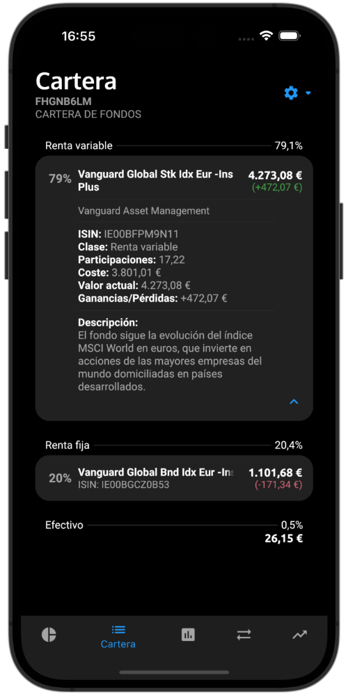
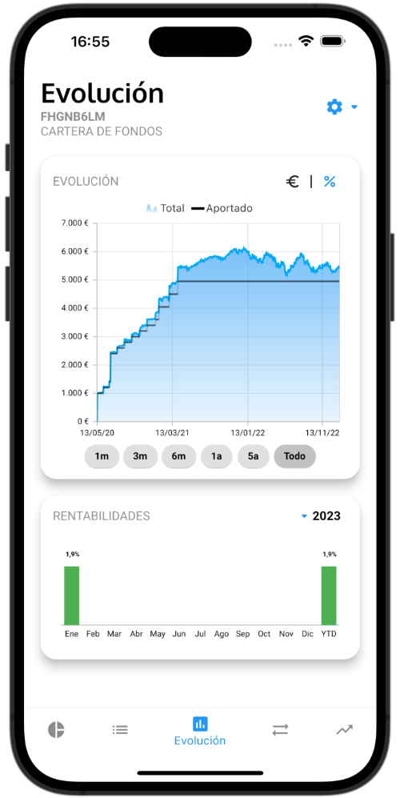
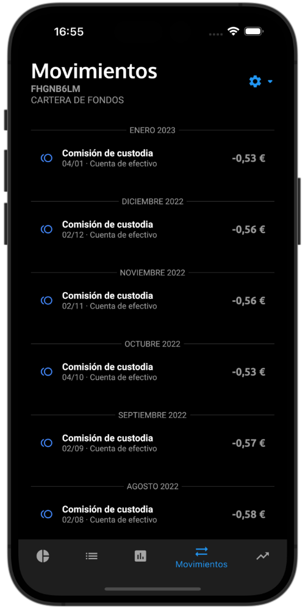

# Indexa X

Indexa X es un cliente multiplataforma no oficial y de código abierto para Indexa Capital.

Está desarrollado en [Flutter](https://flutter.dev/), y utiliza la [API oficial de Indexa Capital](https://indexacapital.com/en/api-rest-v1) para leer los datos de tu cuenta de forma segura.

Actualmente sólo está disponible para Android, dado que Apple ya no permite su publicación en el App Store.

## Descargar

La versión de iOS ha sido retirada del App Store a petición de Apple. Espero poder volver a ofrecer la app de iOS a los usuarios europeos en el futuro a través de tiendas alternativas a la oficial.

## Privacidad y seguridad
Indexa X no recoge ningún tipo de información sobre ti ni tu cuenta de Indexa. Al identificarte, los datos de tu cuenta se cargan en memoria para poder mostrarlos en pantalla, pero nunca se almacenan de forma persistente en tu dispositivo. Por tanto, desaparecen junto con el resto de la app cuando se cierra el proceso.

Si eliges recordar el token, éste se guardará en tu dispositivo de forma segura y encriptada mediante la librería [flutter_secure_storage](https://pub.dev/packages/flutter_secure_storage). Puedes eliminarlo en cualquier momento cerrando sesión en la app.

La API de Indexa sólo permite operaciones de lectura (métodos GET), por lo que Indexa X no puede operar con tu cuenta ni modificarla de ninguna forma.

## Contribuir
Si quieres ayudar a mejorar Indexa X, puedes:
- Proponer cambios o nuevas funcionalidades
- Trabajar en una propuesta existente y enviar un pull request
- Hace una donación

Echa un ojo a la [página de issues](https://github.com/victor-marino/indexax/issues)!

## Donar
Indexa X es una app gratuita, sin anuncios ni monetización de ningún tipo, y siempre será así!

Si te gustaría apoyar su desarollo continuado (o simplemente darme las gracias), puedes invitarme a una cerveza en Ko-fi ;-)

